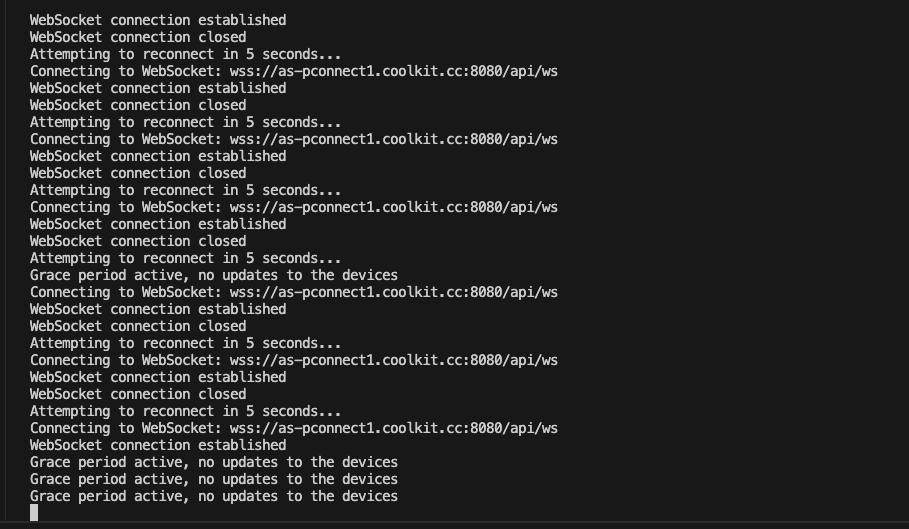
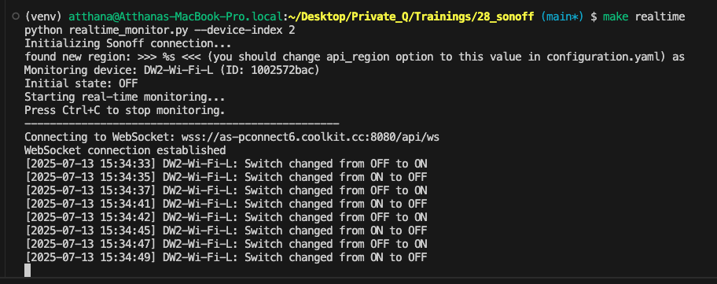
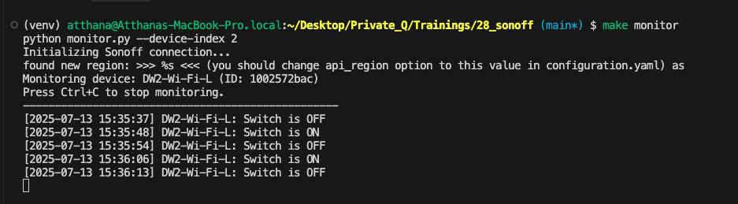

# Sonoff by Atthana

A Python-based monitoring and control system for Sonoff devices. This project allows you to interact with Sonoff smart devices, monitor their status in real-time, and control them programmatically.

## Table of Contents

- [Project Overview](#project-overview)
- [Setting Up the Project](#setting-up-the-project)
- [Configuration](#configuration)
- [Running the Applications](#running-the-applications)
- [File Descriptions](#file-descriptions)
- [Troubleshooting](#troubleshooting)
- Q-Path `/Users/atthana/Desktop/Private_Q/Trainings/28_sonoff`

## Project Overview

This project provides a Python interface to the Sonoff API, allowing you to:

- Connect to your Sonoff account
- List all your devices
- Monitor device status in real-time
- Control devices (turn them on/off)

The project includes multiple scripts for different purposes, from basic device status checking to real-time monitoring with WebSockets.

## Setting Up the Project

### Prerequisites

- Python 3.6 or higher
- pip (Python package manager)
- A Sonoff account with registered devices

### Installation

1. Clone this repository or download the source code

2. Create a virtual environment (recommended):
   ```bash
   python -m venv venv
   source venv/bin/activate  # On Windows: venv\Scripts\activate
   ```

3. Install the required dependencies:
   ```bash
   pip install requests websocket-client
   ```

   Or use the Makefile:
   ```bash
   make setup
   ```

4. Configure your Sonoff credentials in `config.py` (see [Configuration](#configuration))

## Configuration

Before running any of the scripts, you need to set up your Sonoff account credentials in the `config.py` file:

```python
# config.py
username = "your_email@example.com"  # Your Sonoff account email
password = "your_password"          # Your Sonoff account password
api_region = "cn"                   # API region (usually 'cn', 'us', 'eu')

# These will be populated automatically after first run
user_apikey = None
bearer_token = None
```

Replace the placeholder values with your actual Sonoff account credentials.

## Running the Applications

The project includes several scripts for different purposes:

### 1. Basic Device Status Check (`main.py`)

This script performs a one-time check of your devices and displays the status of a specific device.

```bash
make run
# or
python main.py
```

Output example:
```
------ config ------
your_email@example.com
your_password
cn
found new region: >>> as <<< (you should change api_region option to this value in configuration.yaml)
---------
DW2-Wi-Fi-L
1002572bac
off
```

### 2. Basic Polling Monitor (`monitor.py`)

This script continuously monitors a device's status by polling the API at regular intervals (default: every 5 seconds).

```bash
make monitor
# or
python monitor.py
```

Output example:
```
Initializing Sonoff connection...
Monitoring device: DW2-Wi-Fi-L (ID: 1002572bac)
Press Ctrl+C to stop monitoring.
--------------------------------------------------
[2025-07-13 12:31:24] DW2-Wi-Fi-L: Switch is OFF
[2025-07-13 12:31:29] DW2-Wi-Fi-L: Switch is ON
```

### 3. Real-time WebSocket Monitor (`realtime_monitor.py`)

This advanced script uses WebSockets to receive instant notifications when device status changes, providing true real-time monitoring.

```bash
make realtime
# or
python realtime_monitor.py
```

Output example:
```
Initializing Sonoff connection...
Monitoring device: DW2-Wi-Fi-L (ID: 1002572bac)
Initial state: OFF
Starting real-time monitoring...
Press Ctrl+C to stop monitoring.
--------------------------------------------------
Connecting to WebSocket: wss://as-pconnect2.coolkit.cc:8080/api/ws
WebSocket connection established
[2025-07-13 12:30:58] DW2-Wi-Fi-L: Switch changed from OFF to ON
```

## File Descriptions

- **main.py**: Basic script to check device status once
- **monitor.py**: Polling-based monitoring script (checks status at regular intervals)
- **realtime_monitor.py**: WebSocket-based real-time monitoring script
- **config.py**: Configuration file for Sonoff account credentials
- **sonoff/sonoff.py**: Core library for interacting with the Sonoff API
- **Makefile**: Utility commands for common tasks

## Troubleshooting

### SSL Certificate Verification Issues

If you encounter SSL certificate verification errors during local testing, the code already includes a fix that disables SSL verification for WebSocket connections. This is implemented in both the `sonoff.py` library and the monitoring scripts.

### Connection Issues

If you're having trouble connecting to the Sonoff API:

1. Verify your credentials in `config.py`
2. Check your internet connection
3. Ensure your Sonoff account is active and has devices registered
4. Try updating the `api_region` value if the automatic region detection fails

### Device Not Found

If you see "Device not found" errors, check the device index in your scripts. The default is set to index 2, but your device might be at a different index. You can modify the device index in the scripts or use the Makefile options.

---

### Running app by Makefile

Ref:
1. Lib `sonoff-python` > https://github.com/lucien2k/sonoff-python
2. Lib `websocket-client` > We use this lib to connect to the Sonoff WebSocket API directly.
```
Connecting to WebSocket: wss://as-pconnect6.coolkit.cc:8080/api/ws
```
3. Fix problem in lib by replace `sonoff.py` from https://github.com/lucien2k/sonoff-python/issues/27#issuecomment-720433887
or use from here > [./sonoff_backup.py](./sonoff_backup.py) to replace in lib `venv/lib/python3.11/site-packages/sonoff/sonoff.py` otherwise will error ja.
4. But sometimes still having error > `WebSocket connection closed` > `Attempting to reconnect in 5 seconds...` นะ แล้วก้อ get status ไม่ได้



<br>

Steps:
1. `source ./venv/bin/activate`
2. `pip install -r requirements.txt`
3. Key in `username` and `password` in `config.py` > take credentials from `eWeLink` app
4. `make realtime` > will show realtime by websocket (Best for development and debugging)


5. `make monitor` > will show realtime by polling (every 5 seconds interval checking)


6. `make run` > will show basic device status (one time check)
